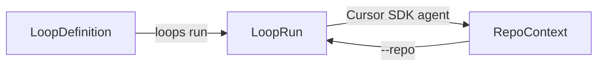

# Concepts

Loops has three core ideas: **loop definitions**, **loop runs**, and **repo context**.

## Loop definition

A saved instruction or workflow template.

Example: a loop named `refactor` with a default prompt like "refactor code to follow clean architecture."

- Created with `loops add <name>`
- Stored at `~/.loops/definitions/<name>.json`
- Reusable across any repository
- Deleted with `loops rm <name>`

A definition can include:

- `description` — human-readable summary
- `defaultPrompt` — inline instruction used when no `--prompt` is passed
- `defaultPreset` — path to a markdown instruction file
- `defaultModel` — default agent model (default: `composer-2.5`)
- `provider` — agent backend (`cursor` today)

## Loop run

A live execution instance of a loop on a specific repository.

Example: the `refactor` loop currently running on `./my-app` with run id `a1b2c3d4`.

- Started with `loops run <name>`
- Stored at `~/.loops/runs/<run-id>.json`
- Runs in a background worker process
- Stopped with `loops stop <run-id>`
- Listed with `loops ls`

Each run tracks:

- repository path
- resolved prompt
- model used for the run
- status (`starting`, `running`, `stopped`, `finished`, `error`)
- optional budget and task limits
- tasks completed and estimated cost

## Repo context

The codebase where the loop operates.

Specified with `--repo /path/to/repository`. Defaults to the current working directory.

The repo path is passed to the Cursor SDK as the local agent `cwd`, so the agent reads and writes files in that project.

## Continuous vs one-shot

| Mode | Flag | Behavior |
| --- | --- | --- |
| Continuous (default) | — | Keeps sending the prompt on the same agent until stopped or limits are hit |
| One-shot | `--once` | Executes a single task and exits |

## Prompt resolution

When you run a loop, the prompt is resolved in this order:

1. `--prompt "inline text"`
2. `--preset ./path/to/message.md`
3. Definition `defaultPreset`
4. Definition `defaultPrompt`

If none are available, the command fails with a clear error.

## Model resolution

When you run a loop, the model is resolved in this order:

1. `--model <id>` on `loops run`
2. Definition `defaultModel` (from `loops add --model`)
3. Global default (`composer-2.5`)

Invalid models are rejected before the worker starts.

## Run model

Each run stores the resolved model id on its run record (`model`).

- View with `loops model show <name|run-id>`
- Update with `loops model set <name|run-id> --model <id>`

For active continuous runs, model edits apply on the **next** agent task. The worker reloads the model from disk before each task and before every state save, so mid-task `loops model set` is not overwritten.

## Run prompt

Each run stores the resolved prompt text on its run record (`prompt`, and optionally `presetPath`).

- View with `loops prompt show <name|run-id>`
- Update with `loops prompt set <name|run-id> --prompt "..."` or `--preset ./file.md`

For active continuous runs, prompt edits apply on the **next** agent task. The worker reloads the prompt from disk before each task and before every state save, so mid-task `loops prompt set` is not overwritten (the new prompt still takes effect on the next task).

## Limits

Optional guardrails on a run:

- `--budget <usd>` — stop when estimated model cost reaches the limit
- `--tasks <n>` — stop after `n` completed agent turns

Budget is estimated from token usage reported by the Cursor SDK. See [Configuration](configuration.md) for details.
